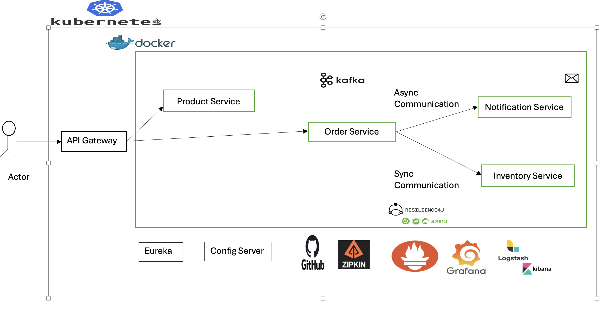
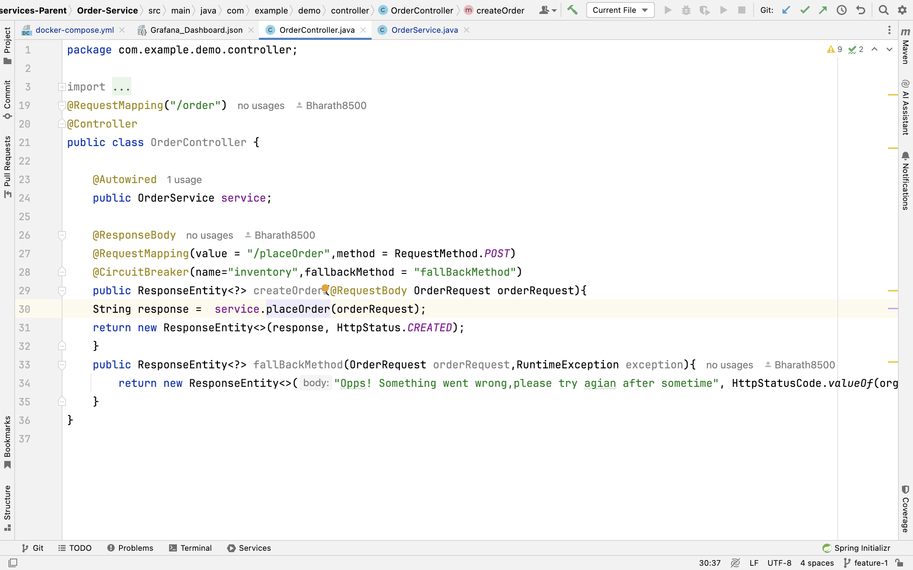
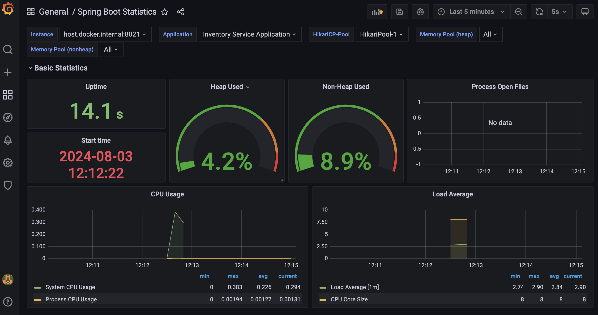

<html lang="en">
  <body>
    

      <h1>E-commerce Microservices Architecture</h1>
      <h2>Project Overview:</h2>
      

        This project outlines a microservices architecture for an e-commerce
        platform. The system utilizes Docker containers orchestrated by
        Kubernetes for deployment and management.
      

      
      <h3>Key Components:</h3>
      <ul>
        <li>
          <h4 style="display: inline">API Gateway:</h4>
          Handles incoming requests and routes them to appropriate services.
        </li>
        <li>
          <h4 style="display: inline">Product Service:</h4>
          Manages product information, including catalog and inventory.
        </li>
        <li>
          <h4 style="display: inline">Order Service:</h4>
          Processes customer orders and interacts with Inventory Service.
        </li>
        <li>
          <h4 style="display: inline">Inventory Service:</h4>
          Tracks product availability and updates inventory levels.
        </li>
        <li>
          <h4 style="display: inline">Notification Service:</h4>
          Sends order confirmations and updates.
        </li>
      </ul>
      <h3>Communication</h3>
      <ul>
        <li>
          <h4 style="display: inline">Async Communication:</h4>
          Uses Kafka for asynchronous messaging between services, primarily for
          notifications and updates.
        </li>
        <li>
          <h4 style="display: inline">Sync Communication:</h4>
          Utilizes RESTful APIs for synchronous communication between services,
          such as order processing and inventory checks.
        </li>
      </ul>
      <h3>Resilience</h3>
      <ul>
      <li>
        <h4 style="display: inline">Resilience4j:</h4>
        Implements circuit breakers and rate limiters to protect services from
        failures and overloads.
      </li>
      </ul>
      
    

    <h3>Infrastructure:</h3>
    <ul>
      <h4 style="display: inline">Spring Boot: :</h4>
      Framework for building microservices.
    </ul>
    <ul>
      <h4 style="display: inline">Eureka:</h4>
      Service discovery for locating microservices.
    </ul>
    <ul>
      <h4 style="display: inline">Config Server:</h4>
      Centralized configuration management.
    </ul>
    <ul>
      <h4 style="display: inline">Logstash, Elasticsearch, Kibana (ELK):</h4>
      Logging and monitoring stack.
    </ul>
    <ul>
      <h4 style="display: inline">Zipkin:</h4>
      Distributed tracing for monitoring service performance.
    </ul>
    <ul>
      <h4 style="display: inline">Grafana:</h4>
      Visualization and analytics platform.
    </ul>
    <ul>
      <h4 style="display: inline">GitHub:</h4>
      Version control for code.
    </ul>
    

      <h3>
        Monitoring All E-commerce Microservices with Grafana and Prometheus
      </h3>
      <h4>Expanding Monitoring to All Services</h4>
      

        To effectively monitor the entire e-commerce microservices architecture,
        it's essential to extend the Grafana dashboard and Prometheus
        configuration to encompass all services. This includes the API Gateway,
        Product Service, Order Service, Notification Service, and any additional
        components.
      

      
    

    

      <h4>Overall Goal:</h4>
      

        By combining these technologies, the project aims to create a scalable,
        resilient, and observable e-commerce platform. Prometheus and Grafana
        enable effective monitoring, while Zipkin helps in troubleshooting and
        performance optimization. Docker ensures efficient deployment and
        management of the microservices.
      

    

  </body>
</html>
